# LemonMusic

## 0. 开发所需的第三方控件

StyleControl V4.02以上版本 
Tms V8.4以上版本 
NextGrid V6.0以上版本 
SuperObject 
VLClib V3.06 
VLC动态库 
bass动态库 
QRCode动态库 
DEVExpress V17.6以上版本 

## 1. 国内4大音乐平台歌曲搜索

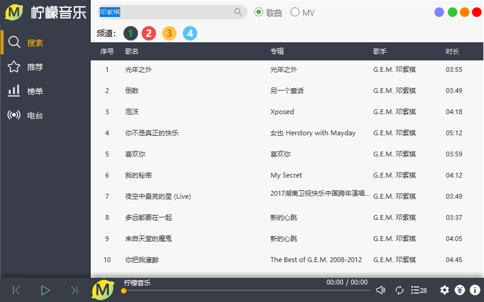

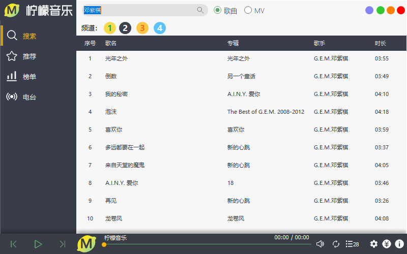

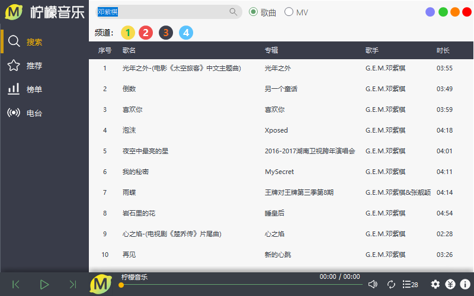

## 2. 频谱显示

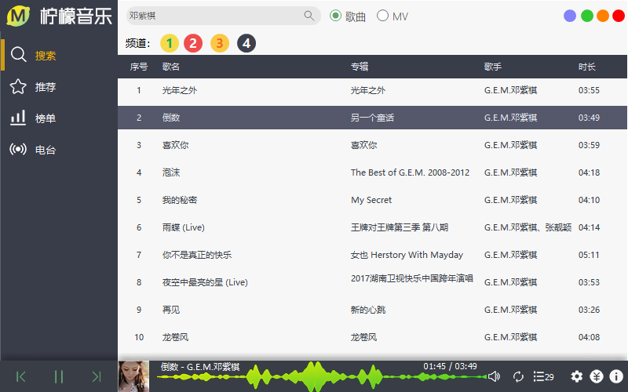

## 3. 歌单推荐

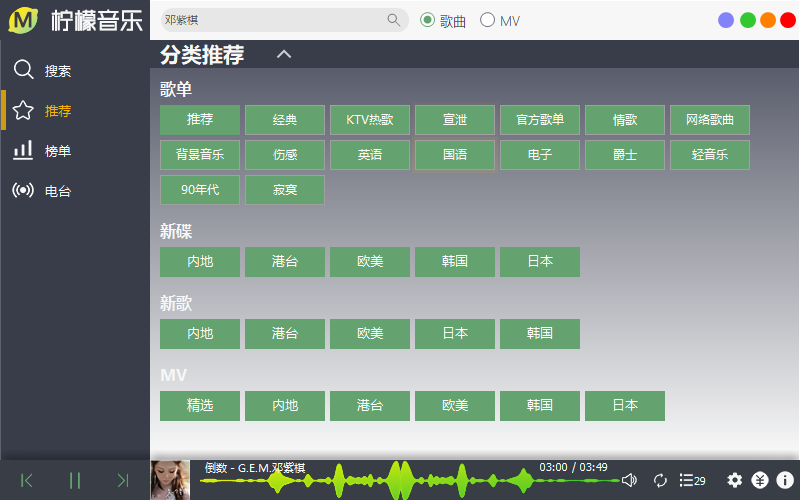

## 4. MV推荐和播放（待完善）

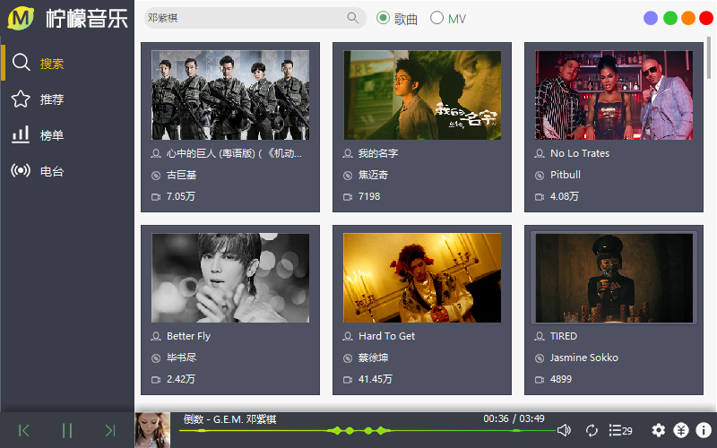

## 5. 频道推荐（待完善）

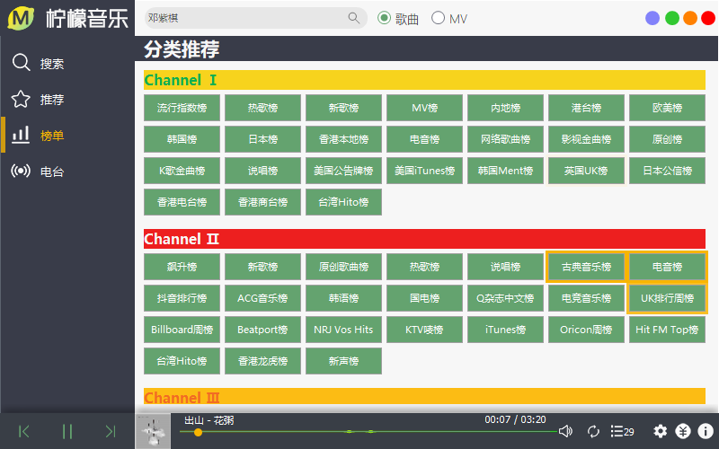

## 6. 电台推荐（待完善）

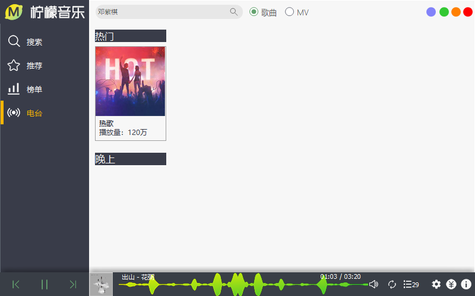

## 7. 3种循环模式

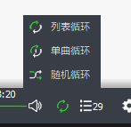

## 8. 列表管理

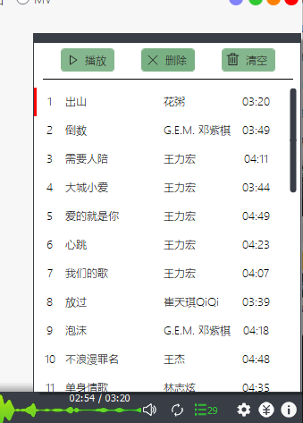

## 9. Mini模式

## 10. Taskbar模式（不完善，慎用，仅支持win10）

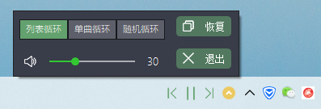

## 11. 分享歌曲

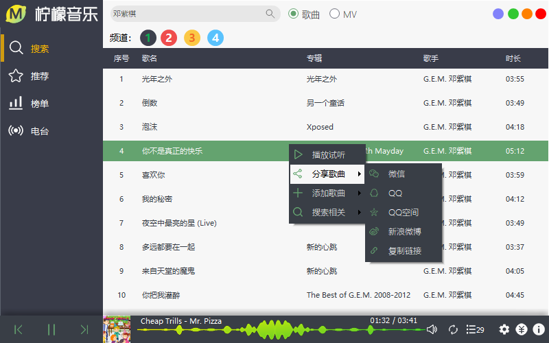

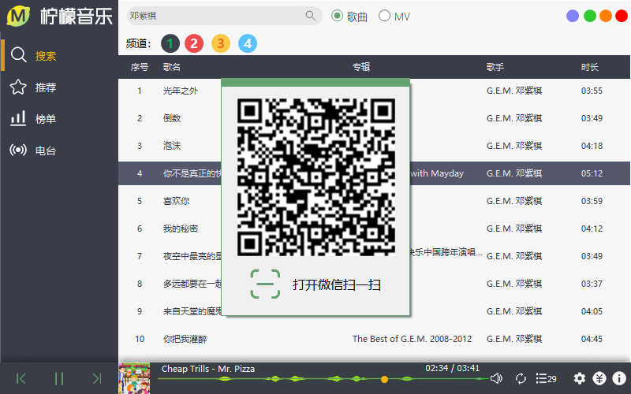